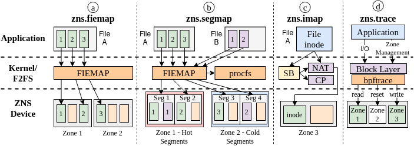
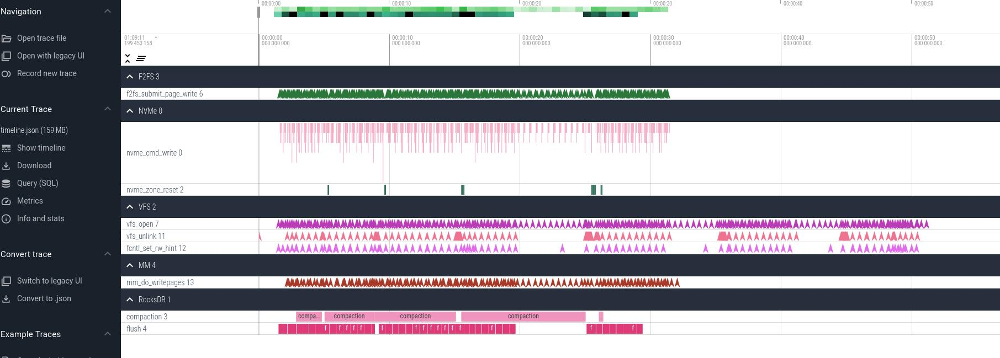
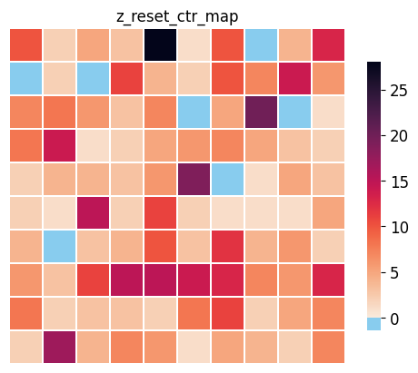

# zns-tools

This repository contains several tools for evaluating the usage of applications and file systems on ZNS devices. The tools generally apply to ZNS devices and file systems on ZNS (currently F2FS and Btrfs), we mention which applications/file systems apply for each tool. We provide an example for each of the tools in the `examples/` directory, showing how to run each tool and what information will be available in the output.

The figures below visualize the organization of the `zns-tools`, with the interaction of the various components and the
file system, Linux kernel, and ZNS device.


Below we illustrate an example timeline that the tools can generate to visualize events across the Linux storage stack.


## What's New

- Introduce [`zns-tools.app`](zns-tools.app) to generate full timeline visualization of the different storage layers by inserting probes into the various Linux storage stack layers, allowing to visualize how user-space operations generate requests throughout the storage stack.
- Improve the performance of the tools by reducing time complexity to O(n), with decreased memory consumption.
- Increase file system support to `Btrfs` and `F2FS`.
- Expand LBAF support to 512B and 4KiB for the tools.
- Stable Release V1.0.0

## Resources

See the below papers for publications of this work, further reading from us on understanding the ecosystem around ZNS and Flash SSDs.

- **Understanding (Un)Written Contracts of NVMe ZNS Devices with zns-tools** Nick Tehrany, Krijn Doekemeijer, and Animesh Trivedi, <https://arxiv.org/abs/2307.11860>, (2023). [PDF](https://arxiv.org/pdf/2307.11860.pdf)
- **Performance Characterization of NVMe Flash Devices with Zoned Namespaces (ZNS)** Krijn Doekemeijer, Nick Tehrany, Balakrishnan Chandrasekaran, Matias Bjørling, and Animesh Trivedi, <https://arxiv.org/abs/2206.01547>, (2023). [PDF](https://atlarge-research.com/pdfs/2023-cluster-zns-performance-kdoekemeijer.pdf)
- **Understanding NVMe Zoned Namespace (ZNS) Flash SSD Storage Devices** Nick Tehrany and Animesh Trivedi, <https://arxiv.org/abs/2206.01547>, (2022). [PDF](https://arxiv.org/pdf/2206.01547.pdf)
- **A Survey on the Integration of NAND Flash Storage in the Design of File Systems and the Host Storage Software Stack** Nick Tehrany, Krijn Doekemeijer, and Animesh Trivedi, <https://arxiv.org/pdf/2307.11866>, (2023). [PDF](https://arxiv.org/pdf/2307.11866.pdf)
- **msF2FS: Design and Implementation of an NVMe ZNS SSD Optimized F2FS File System** Nick Tehrany, <https://repository.tudelft.nl/islandora/object/uuid:3c2b3e73-6aff-45f3-af43-31a50314b547>, MSc. Thesis, (2023). [PDF](https://repository.tudelft.nl/islandora/object/uuid:3c2b3e73-6aff-45f3-af43-31a50314b547/datastream/OBJ/download)

## Requirements

- [json-c](https://github.com/json-c/json-c)
- [bpftrace](https://github.com/iovisor/bpftrace)
- [nvme-cli](https://github.com/linux-nvme/nvme-cli)

## Compiling and Running zns-tools.fs

Compiling will check the system requirements and notify the user of any missing/unsupported header files.
**Note**, all these tools for `zns-tools.fs` are present in the `zns-tools.fs/` directory.

```bash
cd zns-tools.fs/
sh ./autogen.sh
./configure
make

# Install or use executables in src/ 
sudo make install
```

## How to use the tools

The tools aim to further the understanding of the storage, identify how file placement decisions are made, and how I/O is done. We provide several examples how the tools can help our understanding of file systems and ZNS SSD.

### How can the addresses of files be located on the ZNS SSD?

It may be important to understand how and where file systems allocate space for the file data to be stored. For this, the tools interact with the file system to retrieve relevant information on physical block addresses of files, and provide these to the user in a comprehensible manner. For instance, locating a file called `to_be_located_file.txt` can be done as follows:

```bash
user@stosys:~/src/zns-tools/zns-tools.fs/src$ sudo ./zns.fiemap -f to_be_located_file.txt
====================================================================
                        EXTENT MAPPINGS
====================================================================

**** ZONE 13 ****
LBAS: 0x3000000  LBAE: 0x321a800  CAP: 0x21a800  WP: 0x3400000  SIZE: 0x400000  STATE: 0xe0  MASK: 0xffc00000

EXTID: 33    PBAS: 0x30e2938   PBAE: 0x30e2980   SIZE: 0x48
EXTID: 34    PBAS: 0x30ebe00   PBAE: 0x30ebe10   SIZE: 0x10
```

which provides the information of the file extents (representing the physical regions of the data on the ZNS SSD), and maps these to information on which zones it is, alongside further statistics. This furthermore aids in answering the question of how the file system allocates different files.

### How can we identify the utilization of applications and the Linux storage stack of ZNS SSDs?

Understanding the utilization of a storage device is vital to identify shortcomings/bottlenecks within systems. For this purpose, we developed a tracing framework to collect data on all ongoing I/O requests to the device and generate a set of heatmaps to visualize the distribution of I/O activity on the ZNS SSD. The below figure illustrates the number of zone reset commands issued to the respective zones on the ZNS device.



For further examples of all the tools, also see the examples below [here](#examples).

## Examples

In the `examples/` directory we provide an execution for each of the tools, and detail what the output will look like. For more detail on running and understanding output, consult the respective manuals in `man` (or using man `zns.<tool_name>` if zns-tools are installed globally on system).

## File Mapping Tools

The `src/` directory contains several tools for identifying and mapping out F2FS file allocation.

### zns.fiemap

**Currently supported:** F2FS and Btrfs

`zns.fiemap` is a tool that uses the `ioctl()` call to extract mappings for a file, and map these to the zones on a ZNS device. With `FIEMAP`, a single contiguous extent, which physically has consecutive addresses, is returned. It is used find all extents of a file and show their location. Extents can, especially over time as they are updated and the file system runs GC, end up spread across multiple zones, be in random order in zones, and be split it up into a large number of smaller extents. We provide an example output for a small run to locate data on a ZNS, located in the `examples/zns.fiemap.md`. For more details see the manual in `zns.fiemap.8`

```bash
# Run: zns.fiemap -f [file path to locate]
sudo ./zns.fiemap -f /mnt/f2fs/file_to_locate
```

It needs to run with `sudo`, since the program is required to open file descriptors on devices (which can only be done with privileges). The possible flags for `zns.fiemap` are

```bash
sudo ./zns.fiemap [flags]
-f [file_name]: The file to be mapped (Required)
-h:             Show the help menu
-s:             Show holes in between extents
-w:             Show Extent Flags
-l:             Set the logging level [1-2] (Default 0)
-i:             Show info prints with the results
```

**Note**, with F2FS if there is space on the conventional device, after the metadata (NAT,SIT,SSA,CP), it places file data onto the conventional device. Such extents cannot be mapped to zones and are therefore ignored. If the output shows `No extents found on device`, while you were expecting extents to be mapped, verify that these are not on the conventional device. Run with `-l 2` (higher log level) to show all extent mappings, it will say on which device these are found, if the extent is being ignored, and check with `zns.imap -s` the information in the superblock for the `main_blkaddr`, which is where F2FS starts writing data from.

#### Example Output

Below is an example output of running `zns.fiemap`. For illustrative purposes the output is shortened.

```bash
user@stosys:~/src/zns-tools/zns-tools.fs/src$ sudo ./zns.fiemap -f /mnt/f2fs/db0/LOG -s
====================================================================
                        EXTENT MAPPINGS
====================================================================

**** ZONE 13 ****
LBAS: 0x3000000  LBAE: 0x321a800  CAP: 0x21a800  WP: 0x3400000  SIZE: 0x400000  STATE: 0xe0  MASK: 0xffc00000

EXTID: 33    PBAS: 0x30e2938   PBAE: 0x30e2980   SIZE: 0x48
--- HOLE:    PBAS: 0x30e2980   PBAE: 0x30ebe00   SIZE: 0x9480
EXTID: 34    PBAS: 0x30ebe00   PBAE: 0x30ebe10   SIZE: 0x10
--- HOLE:    PBAS: 0x30ebe10   PBAE: 0x3181e28   SIZE: 0x96018
EXTID: 35    PBAS: 0x3181e28   PBAE: 0x3181e30   SIZE: 0x8
--- HOLE:    PBAS: 0x3181e30   PBAE: 0x31d1d80   SIZE: 0x4ff50
EXTID: 36    PBAS: 0x31d1d80   PBAE: 0x31d1da8   SIZE: 0x28
--- HOLE:    PBAS: 0x31d1da8   PBAE: 0x321a800   SIZE: 0x48a58

**** ZONE 16 ****
LBAS: 0x3c00000  LBAE: 0x3e1a800  CAP: 0x21a800  WP: 0x4000000  SIZE: 0x400000  STATE: 0xe0  MASK: 0xffc00000

--- HOLE:    PBAS: 0x3c00000   PBAE: 0x3c26890   SIZE: 0x26890
EXTID: 70    PBAS: 0x3c26890   PBAE: 0x3c268a8   SIZE: 0x18
.
====================================================================
                        STATS SUMMARY
====================================================================

NOE: 76    TES: 0xef8       AES: 0x31        EAES: 49.766234   NOZ: 17
NOH: 92    THS: 0x2230d60   AHS: 0x5f23b     EAHS: 389691.478261
```

### zns.segmap

**Currently supported:** F2FS and Btrfs

`zns.segmap` similarly to `zns.fiemap`, takes extents of files and maps these to segments on the ZNS device. The aim being to locate data placement across segments, with fragmentation, as well as indicating good/bad hotness classification. The tool calls `fiemap` on all files in a directory and maps these in LBA order to the segments on the device. Since there are thousands of segments, we recommend analyzing zones individually, for which the tool provides the option for, or depicting zone ranges. The directory to be mapped is typically the mount location of the file system, however any subdirectory of it can also be mapped, e.g., if there is particular interest for locating WAL files only for a database, such as with RocksDB.

As this tool relies on mapping to segments, for Btrfs it simply applies the `zns.fiemap` (mapping files to zones) for all files in the directory. Any segment flags is ignored for it.

```bash
# Run: zns.fiemap -d [dir to map]
sudo ./zns.fiemap -d /mnt/f2fs/
```

Again, it requires to be run with root privileges. Possible flags are:

```bash
-d [dir]:   Mounted dir to map [Required]
-h:         Show this help
-l [0-2]:   Set the logging level
-p:         Resolve segment information from procfs
-i:         Resolve inlined file data in inodes
-w:         Show extent flags (Currently only for logging with -l 2)
-s [uint]:  Set the starting zone to map. Default zone 1.
-z [uint]:  Only show this single zone
-e [uint]:  Set the ending zone to map. Default last zone.
-s:         Show segment statistics (requires -p to be enabled)
-o:         Show only segment statistics (automatically enables -s flag)
```

The `-i` flag is meant for very small files that have their data inlined into the inode. If this flag is enabled, extents will show up with a `SIZE: 0`, indicating the data is inlined in the inode.
**Note,** running this on large files (several GB) can take several minutes to run, as it collects each individual extent, which at that point can be hundreds of thousands, and then needs to map these to zones by sorting the extents and collecting statistics. These are very resource heavy, therefore we recommend using this for smaller setups to understand initial mappings of file data.

#### Example Output

Below is an example output of running the `zns.segmap` tool. For illustrative purposes the output is shortened.

```bash
user@stosys:~/src/zns-tools$ sudo ./zns-tools.fs/src/zns.segmap -d /mnt/f2fs/ -p -i -s 7 -e 9
====================================================================
                        SEGMENT MAPPINGS
====================================================================

============ ZONE 14 ============
LBAS: 0x3400000  LBAE: 0x361a800  CAP: 0x21a800  WP: 0x35f79e8  SIZE: 0x400000  STATE: 0x20  MASK: 0xffc00000

_____________________________________________________________________________________________________________
-------------------------------------------------------------------------------------------------------------
SEGMENT: 13342  PBAS: 0x341e000   PBAE: 0x341f000   SIZE: 0x1000    
+++++ TYPE: CURSEG_HOT_DATA  VALID BLOCKS:  80
-------------------------------------------------------------------------------------------------------------
***** EXTENT:   PBAS: 0x341e800   PBAE: 0x341e848   SIZE: 0x48  FILE: /mnt/f2fs//db0/LOG         EXTID:   2/7    
***** EXTENT:   PBAS: 0x341e850   PBAE: 0x341e858   SIZE: 0x8   FILE: /mnt/f2fs//db0/000038.sst  EXTID:   3/3    

_____________________________________________________________________________________________________________
-------------------------------------------------------------------------------------------------------------
SEGMENT: 13468  PBAS: 0x349c000   PBAE: 0x349d000   SIZE: 0x1000    
+++++ TYPE: CURSEG_HOT_DATA  VALID BLOCKS:  32
-------------------------------------------------------------------------------------------------------------
***** EXTENT:  PBAS: 0x349c868   PBAE: 0x349c870    SIZE: 0x8   FILE: /mnt/f2fs//db0/000042.sst  EXTID: 38/38   
***** EXTENT:  PBAS: 0x349c870   PBAE: 0x349c880    SIZE: 0x10  FILE: /mnt/f2fs//db0/LOG         EXTID:   3/7    
***** EXTENT:  PBAS: 0x349c888   PBAE: 0x349c890    SIZE: 0x8   FILE: /mnt/f2fs//db0/000043.sst  EXTID:   3/3
.
====================================================================
                        SEGMENT STATS
====================================================================
-----------------------------------------------------------------------------------------------------------
Dir/File Name   | # Extents | # Segments | # Occupying Zones | Cold Segments | Warm Segments | Hot Segments
-----------------------------------------------------------------------------------------------------------
/mnt/f2fs/      | 179       | 2621       | 6                 | 2002          | 532           | 87
___________________________________________________________________________________________________________
-----------------------------------------------------------------------------------------------------------
db0/LOG         | 7         | 1          | 1                 | 0             | 0             | 1
db0/000042.sst  | 38        | 146        | 3                 | 145           | 0             | 1
db0/000044.sst  | 5         | 113        | 3                 | 112           | 0             | 1
db0/000047.sst  | 5         | 113        | 3                 | 112           | 0             | 1
.
```

### zns.imap

**Currently supported:** F2FS

`zns.imap` is meant to get some information from the F2FS setup. It locates and prints the inode a file, and can furthermore print the contents of the F2FS superblock and checkpoint area. We recommend running this in the verbose logging to get more information, as this tool is merely meant for information on F2FS layout.

```bash
sudo ./zns-tools.fs/src/zns.imap -f /mnt/f2fs/LOG -l 1
```

Possible flags are:

```bash
-f [file]:       Input file retrieve inode for [Required]
-l [Int, 0-1]:   Log Level to print (Default 0)
-s:              Show the superblock
-c:              Show the checkpoint
```

#### Example Output

Below is an example output of running the `zns.imap` tool. For illustrative purposes the output is shortened.

```bash
user@stosys:~/src/zns-tools$ sudo ./zns-tools.fs/src/zns.imap -f /mnt/f2fs/LOG -l 1 -s -c
=================================================================
                        SUPERBLOCK
=================================================================
Note: Sizes and Addresses are in 4KiB units (F2FS Block Size)
magic:                  0xf2f52010
major_version:          1
minor_version:          15
log_sectorsize:         9
log_sectors_per_block:  3
log_blocksize:          12
log_blocks_per_seg:     9
segs_per_sec:           1024
secs_per_zone:          1
.
=================================================================
                        CHECKPOINT
=================================================================
checkpoint_ver:                 747629827
user_block_count:               17883136
valid_block_count:              550951
rsvd_segment_count:             15092
overprov_segment_count:         18972
free_segment_count:             52921
.
=================================================================
                        INODE
=================================================================

File /mnt/f2fs/LOG with inode 4 is located in zone 2

============ ZONE 2 ============
LBAS: 0x400000  LBAE: 0x61a800  CAP: 0x21a800  WP: 0x405730  SIZE: 0x400000  STATE: 0x20  MASK: 0xffc00000

***** INODE:  PBAS: 0x4000f8    PBAE: 0x400101    SIZE: 0x9         FILE: /mnt/f2fs/LOG

>>>>> NODE FOOTER:
nid:                    4
ino:                    4
flag:                   3
next_blkaddr:           1572896
.
```

## zns-tools.nvme

**Currently supported:** Any application on ZNS with Linux kernel and BPF support

In the `zns-tools.nvme/` directory, we provide a framework to trace activity on zns devices across its different zones using BPF, collecting information on number of read/write operations to each zone, amount of data read/written in each zone, and reset statistics, including reset latency per zone. After collecting tracing statistics, zns-tools.nvme automatically generates heatmaps for each collected statistic, depicting the information for each zone in a comprehensible manner.

## zns-tools.app

**Currently supported:** RocksDB with F2FS on ZNS with Linux kernel and BPF support

In the `zns-tools.app/` directory, we provide a framework to trace activity on zns devices across the different layers of the Linux storage stack, and visualizing the collected events in a timeline. See [zns-tools.app](zns-tools.app/README.md) for more details and full examples.

## Evaluation

In the `evaluation/zns-tools-bench` directory we provide a benchmarking for evaluating the performance of zns-tools.
See the README in that directory on how to use the benchmarks.

## Development

For development, if using `gdb` to debug, simply configure with (prior to building)

```bash
./configure \
    --build=x86_64-linux-gnu \
    --host=arm-linux-gnueabihf \
    --target=arm-linux-gnueabihf \
    --disable-shared
```

We also recommend to enable the address sanitizer during compilation. For this simply modify the `lib/Makefile.am` and `src/Makefile.am` to have the `CFLAGS` equal to

```bash
# In lib/Makefile.am 
libzns_tools_la_CFLAGS = -Wall -fsanitize=address -fno-sanitize=vptr

libf2fs_la_CFLAGS = -Wall -fsanitize=address -fno-sanitize=vptr

libjson_la_CFLAGS = -Wall -fsanitize=address -fno-sanitize=vptr

# In src/Makefile.am
AM_CFLAGS = -O0 -Wall -Wextra -g -Wunused-parameter -fsanitize=address -fno-sanitize=vptr
```

## Contributing

For any bugs or new feature requests, you can open an issue and we will attempt to resolve this as soon as possible.
Or fork the repository and submit any fixes you have with pull requests!

We aim to maintain a cleanly formatted code, so before we merge a PR, we ask you to run `clang-format` with the provided format file for any source code.

```bash
# example of how to format all C code in-place in src/
clang-format -i ./zns-tools.fs/src/*.c
```

## Acknowledgements

This code is being developed and run on ZNS SSDs generously donated by Western Digital.
