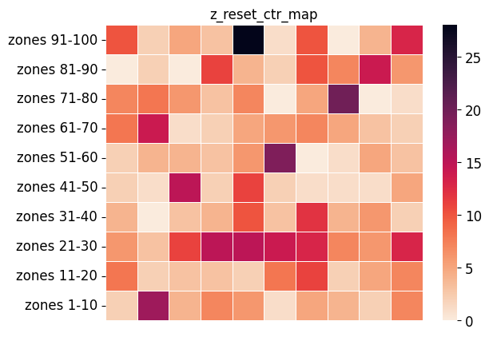

# zns-tools

This repository contains several tools for evaluating file system usage of ZNS devices. The tools generally apply to ZNS devices and file systems on ZNS (F2FS and Btrfs), we mention which applications/file systems apply for each tool. We provide an example for each of the tools in the `examples/` directory, showing how to run each tool and what information will be available in the output.

The blow figures visualizes the organization of the `zns-tools`, with the interaction of the various components and the
F2FS file system, Linux kernel, and the ZNS device.


## Compiling and Running

Compiling will check system requirements and notify of any missing/unsupported header files.

```bash
sh ./autogen.sh
./configure
make

# Install or use executables in src/ 
sudo make install
```

Note, `zns.fpbench` has the possibility to run with multi-streams, which requires our F2FS Kernel build with multi-streams to be installed (see more [here](https://github.com/nicktehrany/f2fs)). By default this support is disabled in the tools, to enabled it run `./configure --enable-multi-streams` instead.

## Examples

In the `examples/` directory we provide an execution for each of the tools, and detail what the output will look like. For more detail on running and understanding output, consult the respective manuals in `man` (or using man `zns.<tool_name>` if installed on system).

## File Mapping Tools

The `src/` directory contains several tools for identifying and mapping out F2FS file allocation.

### zns.fiemap

**Currently supported:** F2FS and Btrfs

`zns.fiemap` is a tool that uses the `ioctl()` call to extract mappings for a file, and map these to the zones on a ZNS device. With `FIEMAP`, a single contiguous extent, which physically has consecutive addresses, is returned. It is used find all extents of a file and show their location. Extents can, especially over time as they are updated and the file system runs GC, end up spread across multiple zones, be in random order in zones, and be split it up into a large number of smaller extents. We provide an example output for a small run to locate data on a ZNS, located in the `examples/zns.fiemap.md`. For more details see the manual in `zns.fiemap.8`

```bash
# Run: zns.fiemap -f [file path to locate]
sudo ./zns.fiemap -f /mnt/f2fs/file_to_locate
```

It needs to run with `sudo`, since the program is required to open file descriptors on devices (which can only be done with privileges). The possible flags for `zns.fiemap` are

```bash
sudo ./zns.fiemap [flags]
-f [file_name]: The file to be mapped (Required)
-h:             Show the help menu
-s:             Show holes in between extents
-w:             Show Extent Flags
-l:             Set the logging level [1-2] (Default 0)
-i:             Show info prints with the results
```

**Note**, with F2FS if there is space on the conventional device, after the metadata (NAT,SIT,SSA,CP), it places file data onto the conventional device. Such extents cannot be mapped to zones and are therefore ignored. If the output shows `No extents found on device`, while you were expecting extents to be mapped, verify that these are not on the conventional device. Run with `-l 2` (higher log level) to show all extent mappings, it will say on which device these are found, if the extent is being ignored, and check with `zns.imap -s` the information in the superblock for the `main_blkaddr`, which is where F2FS starts writing data from.

#### Example Output

Below is an example output of running `zns.fiemap`. For illustrative purposes the output is shortened.

```bash
user@stosys:~/src/zns-tools/src$ sudo ./zns.fiemap -f /mnt/f2fs/db0/LOG -s
====================================================================
                        EXTENT MAPPINGS
====================================================================

**** ZONE 13 ****
LBAS: 0x3000000  LBAE: 0x321a800  CAP: 0x21a800  WP: 0x3400000  SIZE: 0x400000  STATE: 0xe0  MASK: 0xffc00000

EXTID: 33    PBAS: 0x30e2938   PBAE: 0x30e2980   SIZE: 0x48
--- HOLE:    PBAS: 0x30e2980   PBAE: 0x30ebe00   SIZE: 0x9480
EXTID: 34    PBAS: 0x30ebe00   PBAE: 0x30ebe10   SIZE: 0x10
--- HOLE:    PBAS: 0x30ebe10   PBAE: 0x3181e28   SIZE: 0x96018
EXTID: 35    PBAS: 0x3181e28   PBAE: 0x3181e30   SIZE: 0x8
--- HOLE:    PBAS: 0x3181e30   PBAE: 0x31d1d80   SIZE: 0x4ff50
EXTID: 36    PBAS: 0x31d1d80   PBAE: 0x31d1da8   SIZE: 0x28
--- HOLE:    PBAS: 0x31d1da8   PBAE: 0x321a800   SIZE: 0x48a58

**** ZONE 16 ****
LBAS: 0x3c00000  LBAE: 0x3e1a800  CAP: 0x21a800  WP: 0x4000000  SIZE: 0x400000  STATE: 0xe0  MASK: 0xffc00000

--- HOLE:    PBAS: 0x3c00000   PBAE: 0x3c26890   SIZE: 0x26890
EXTID: 70    PBAS: 0x3c26890   PBAE: 0x3c268a8   SIZE: 0x18
.
====================================================================
                        STATS SUMMARY
====================================================================

NOE: 76    TES: 0xef8       AES: 0x31        EAES: 49.766234   NOZ: 17
NOH: 92    THS: 0x2230d60   AHS: 0x5f23b     EAHS: 389691.478261
```

### zns.segmap

**Currently supported:** F2FS and Btrfs

`zns.segmap` similarly to `zns.fiemap`, takes extents of files and maps these to segments on the ZNS device. The aim being to locate data placement across segments, with fragmentation, as well as indicating good/bad hotness classification. The tool calls `fiemap` on all files in a directory and maps these in LBA order to the segments on the device. Since there are thousands of segments, we recommend analyzing zones individually, for which the tool provides the option for, or depicting zone ranges. The directory to be mapped is typically the mount location of the file system, however any subdirectory of it can also be mapped, e.g., if there is particular interest for locating WAL files only for a database, such as with RocksDB.

As this tool relies on mapping to segments, for Btrfs it simply applies the `zns.fiemap` (mapping files to zones) for all files in the directory. Any segment flags is ignored for it.

```bash
# Run: zns.fiemap -d [dir to map]
sudo ./zns.fiemap -d /mnt/f2fs/
```

Again, it requires to be run with root privileges. Possible flags are:

```bash
-d [dir]:   Mounted dir to map [Required]
-h:         Show this help
-l [0-2]:   Set the logging level
-p:         Resolve segment information from procfs
-i:         Resolve inlined file data in inodes
-w:         Show extent flags (Currently only for logging with -l 2)
-s [uint]:  Set the starting zone to map. Default zone 1.
-z [uint]:  Only show this single zone
-e [uint]:  Set the ending zone to map. Default last zone.
-s:         Show segment statistics (requires -p to be enabled)
-o:         Show only segment statistics (automatically enables -s flag)
```

The `-i` flag is meant for very small files that have their data inlined into the inode. If this flag is enabled, extents will show up with a `SIZE: 0`, indicating the data is inlined in the inode.
**Note,** running this on large files (several GB) can take several minutes to run, as it collects each individual extent, which at that point can be hundreds of thousands, and then needs to map these to zones by sorting the extents and collecting statistics. These are very resource heavy, therefore we recommend using this for smaller setups to understand initial mappings of file data.

#### Example Output

Below is an example output of running the `zns.segmap` tool. For illustrative purposes the output is shortened.

```bash
user@stosys:~/src/zns-tools$ sudo ./src/zns.segmap -d /mnt/f2fs/ -p -i -s 7 -e 9
====================================================================
                        SEGMENT MAPPINGS
====================================================================

============ ZONE 14 ============
LBAS: 0x3400000  LBAE: 0x361a800  CAP: 0x21a800  WP: 0x35f79e8  SIZE: 0x400000  STATE: 0x20  MASK: 0xffc00000

_____________________________________________________________________________________________________________
-------------------------------------------------------------------------------------------------------------
SEGMENT: 13342  PBAS: 0x341e000   PBAE: 0x341f000   SIZE: 0x1000    
+++++ TYPE: CURSEG_HOT_DATA  VALID BLOCKS:  80
-------------------------------------------------------------------------------------------------------------
***** EXTENT:   PBAS: 0x341e800   PBAE: 0x341e848   SIZE: 0x48  FILE: /mnt/f2fs//db0/LOG         EXTID:   2/7    
***** EXTENT:   PBAS: 0x341e850   PBAE: 0x341e858   SIZE: 0x8   FILE: /mnt/f2fs//db0/000038.sst  EXTID:   3/3    

_____________________________________________________________________________________________________________
-------------------------------------------------------------------------------------------------------------
SEGMENT: 13468  PBAS: 0x349c000   PBAE: 0x349d000   SIZE: 0x1000    
+++++ TYPE: CURSEG_HOT_DATA  VALID BLOCKS:  32
-------------------------------------------------------------------------------------------------------------
***** EXTENT:  PBAS: 0x349c868   PBAE: 0x349c870    SIZE: 0x8   FILE: /mnt/f2fs//db0/000042.sst  EXTID: 38/38   
***** EXTENT:  PBAS: 0x349c870   PBAE: 0x349c880    SIZE: 0x10  FILE: /mnt/f2fs//db0/LOG         EXTID:   3/7    
***** EXTENT:  PBAS: 0x349c888   PBAE: 0x349c890    SIZE: 0x8   FILE: /mnt/f2fs//db0/000043.sst  EXTID:   3/3
.
====================================================================
                        SEGMENT STATS
====================================================================
-----------------------------------------------------------------------------------------------------------
Dir/File Name   | # Extents | # Segments | # Occupying Zones | Cold Segments | Warm Segments | Hot Segments
-----------------------------------------------------------------------------------------------------------
/mnt/f2fs/      | 179       | 2621       | 6                 | 2002          | 532           | 87
___________________________________________________________________________________________________________
-----------------------------------------------------------------------------------------------------------
db0/LOG         | 7         | 1          | 1                 | 0             | 0             | 1
db0/000042.sst  | 38        | 146        | 3                 | 145           | 0             | 1
db0/000044.sst  | 5         | 113        | 3                 | 112           | 0             | 1
db0/000047.sst  | 5         | 113        | 3                 | 112           | 0             | 1
.
```

### zns.imap

**Currently supported:** F2FS

`zns.imap` is meant to get some information from the F2FS setup. It locates and prints the inode a file, and can furthermore print the contents of the F2FS superblock and checkpoint area. We recommend running this in the verbose logging to get more information, as this tool is merely meant for information on F2FS layout.

```bash
sudo ./src/zns.imap -f /mnt/f2fs/LOG -l 1
```

Possible flags are:

```bash
-f [file]:       Input file retrieve inode for [Required]
-l [Int, 0-1]:   Log Level to print (Default 0)
-s:              Show the superblock
-c:              Show the checkpoint
```

#### Example Output

Below is an example output of running the `zns.imap` tool. For illustrative purposes the output is shortened.

```bash
user@stosys:~/src/zns-tools$ sudo ./src/zns.imap -f /mnt/f2fs/LOG -l 1 -s -c
=================================================================
                        SUPERBLOCK
=================================================================
Note: Sizes and Addresses are in 4KiB units (F2FS Block Size)
magic:                  0xf2f52010
major_version:          1
minor_version:          15
log_sectorsize:         9
log_sectors_per_block:  3
log_blocksize:          12
log_blocks_per_seg:     9
segs_per_sec:           1024
secs_per_zone:          1
.
=================================================================
                        CHECKPOINT
=================================================================
checkpoint_ver:                 747629827
user_block_count:               17883136
valid_block_count:              550951
rsvd_segment_count:             15092
overprov_segment_count:         18972
free_segment_count:             52921
.
=================================================================
                        INODE
=================================================================

File /mnt/f2fs/LOG with inode 4 is located in zone 2

============ ZONE 2 ============
LBAS: 0x400000  LBAE: 0x61a800  CAP: 0x21a800  WP: 0x405730  SIZE: 0x400000  STATE: 0x20  MASK: 0xffc00000

***** INODE:  PBAS: 0x4000f8    PBAE: 0x400101    SIZE: 0x9         FILE: /mnt/f2fs/LOG

>>>>> NODE FOOTER:
nid:                    4
ino:                    4
flag:                   3
next_blkaddr:           1572896
.
```

### zns.fpbench

**Currently supported:** F2FS

`zns.fpbench` is a benchmarking framework that is used for identifying the F2FS placement decisions based on the provided write hint from the benchmark. It writes the file with the specified size, in units of the specified block size, and sets the write hint with `fcntl()`. Concurrently repeating the workload is possible to run the same exact workload on different file names, hence allowing lockless concurrent writing. After writing, all files have extents located, the extents mapped to segments, and segment information retrieved, focusing on the heat classification that the segment was assigned.

```bash
sudo ./src/zns.fpbench -f /mnt/f2fs/bench_file -s 2M -b 4K -w 5 -n 3
```

Possible flags are:

```bash
-f [file]:       Filename for the benchmark [Required]
-l [Int, 0-3]:   Log Level to print (Default 0)
-s:              File size (Default 4096B)
-b:              Block size in which to submit I/Os (Default 4096B)
-w:              Read/Write Hint (Default 0)
                     RWH_WRITE_LIFE_NOT_SET = 0
                     RWH_WRITE_LIFE_NONE = 1
                     RWH_WRITE_LIFE_SHORT = 2
                     RWH_WRITE_LIFE_MEDIUM = 3
                     RWH_WRITE_LIFE_LONG = 4
                     RWH_WRITE_LIFE_EXTREME = 5
-h:              Show this help
-n:              Number of jobs to concurrently execute the benchmark
-c:              Call fsync() after each block written
-d:              Use O_DIRECT for file writes
-m               Map the file to a particular stream
```

The benchmark is simple and is meant for only testing the adherence of F2FS with write hints if I/O is buffered and an `fsync()` is called on each file. For more advanced benchmarks, with asynchronous I/O, different engines and more possible configuration, use `fio` (which also supports write hints with the `--write_hint=short` flag).

## zns.trace

**Currently supported:** Any application on ZNS with Linux kernel and BPF support

In the `zns.trace/` directory, we provide a framework to trace activity on zns devices across its different zones using BPF, collecting information on number of read/write operations to each zone, amount of data read/written in each zone, and reset statistics, including reset latency per zone. After collecting tracing statistics, zns.trace automatically generates heatmaps for each collected statistic, depicting the information for each zone in a comprehensible manner. The below figure illustrates the number of zone reset commands issued to the respective zones on the ZNS device.



## Evaluation

In the `evaluation/` directory we provide a benchmarking setup for evaluating the performance of the zns-tools, and an end-to-end visualization framework for RocksDB to analyze and visualize the data movement of flush/compaction operations, as well as F2FS Zone management operations. 

### Setup

The end-to-end mapping tool requires minor modifications to RocksDB (commit `ccaa3225b`), and the zns-tools (commit `673f665`). The zns-tools patch provides json output instead of terminal output, for the post-processing visualization. We provide respective patches for both, which can be applied with

```bash
# RocksDB patch
patch -p1 < rocksdb.ccaa3225b.patch
patch -p1 < zns-tools.673f665.patch
```

### Running

To run the RocksDB workload, a script is provided that executes all necessary tools, scripts, and data transformation.

```
sh ./timeline_data_rocksdb_gen.sh
```

To then visualize the data, copy it to the `../timeline-gen/` directory and execute the cells in the `plot.ipynb` notebook (`jupyter notebook` to start the notebook).
